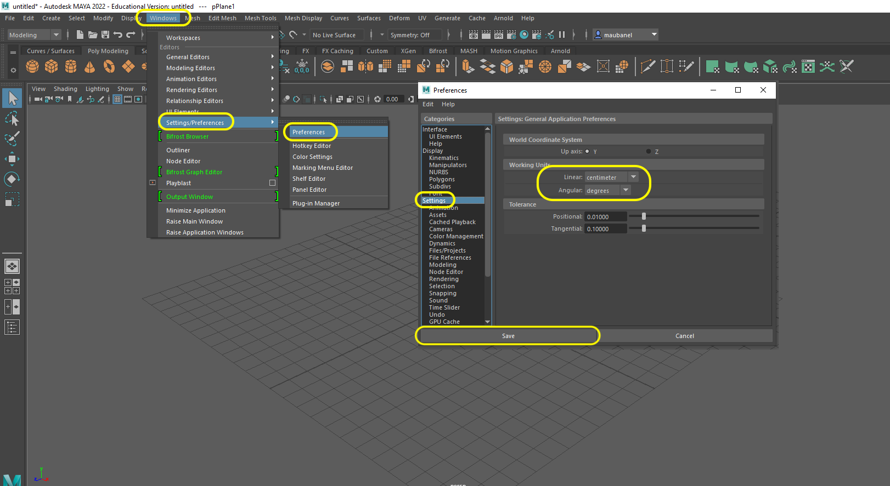
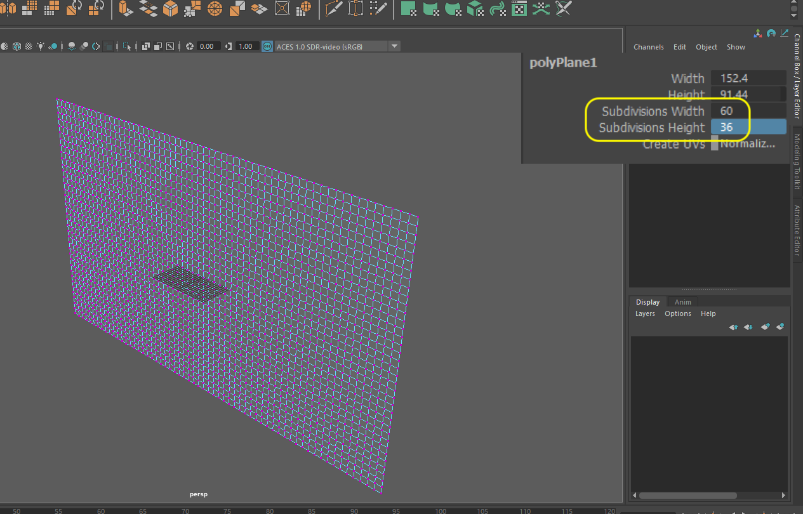
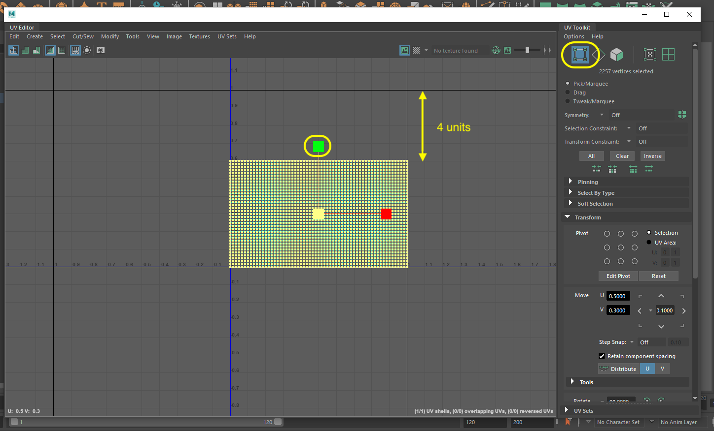

### Making a Flag

[previous](../) • [home](../README.md#user-content-ue4-animated-flag) • [next](../)

Lets go into Maya and create a flag that we will import into Unreal.

 

---

##### `Step 1.`\|`ITA`|:small_blue_diamond:

Open up **Maya 22** to create a new plane to hold our flag. 

##### `Step 2.`\|`FHIU`|:small_blue_diamond: :small_blue_diamond: 

Make sure you are on the **Poly Modeling** tab and drag a plane into the scene.  Since the flag is essentially flat we will use a flat plane.

##### `Step 3.`\|`ITA`|:small_blue_diamond: :small_blue_diamond: :small_blue_diamond:

We need to make sure that the units match Unreal's default units.  So 1 **Maya** unit needs to be in **cm**.  So go to **Windows | Settings/Preferences | Preferences | Settings** and make sure **Working Units | Linear** is set to `centimeter` and **Angular** is set to `degrees`. Press the <kbd>Save</kbd> button.

##### `Step 4.`\|`ITA`|:small_blue_diamond: :small_blue_diamond: :small_blue_diamond: :small_blue_diamond:

A common size for the **[US Flag](https://en.wikipedia.org/wiki/Flag_of_the_United_States)** is 3' by 5'.  If we convert this to centimeters it is 91.44cm to 152.4cm.

##### `Step 5.`\|`ITA`| :small_orange_diamond:

Select the **Outliner** and make sure you have the **pPlane1** selected.  Change the **Width** to `152.4` and the **Height** to `91.44`.  Also, a flag is rarely flat on the ground so lets put it upright (like it is on a flag pole) by rotating the **Rotate X** axis by `90` degrees.

##### `Step 6.`\|`ITA`| :small_orange_diamond: :small_blue_diamond:

Now animation happens on the vertices.  So the more vertices the more folds and realistic animation we will get.  Now this comes at a cost to performance.  Lets pick a pretty dense mesh to see how good it can look. Lets set the **Subdivision Width** to `60` units.  Now for a 3 x 5 aspect ratio model, to make these subdivisions square we need to find out the height.

Divide height by width or 3/5 or 0.6.  Now multiply 60 by .6 which equals 36. So lets set the **Subdivision Height** to `36`.

##### `Step 7.`\|`ITA`| :small_orange_diamond: :small_blue_diamond: :small_blue_diamond:

Open up the **UV** editor window to look at our UV's.

##### `Step 8.`\|`ITA`| :small_orange_diamond: :small_blue_diamond: :small_blue_diamond: :small_blue_diamond:

Now the UV's are not taking the entire height and show a gap. 

##### `Step 9.`\|`ITA`| :small_orange_diamond: :small_blue_diamond: :small_blue_diamond: :small_blue_diamond: :small_blue_diamond:

Click no the **vertex selection** tool and drag the mouse around all the vertices to select them.  Change to the scale tool and scale it on the **V** axis.  It needs to scale by .4 units (4 grids).

##### `Step 10.`\|`ITA`| :large_blue_diamond:

Change to the transform tool. Move the UV set to fit with the `0` and `1` range.  I had to move it up .2 units on the **v** axis.

##### `Step 11.`\|`ITA`| :large_blue_diamond: :small_blue_diamond: 

Press the <kbd>D</kbd> key and move the pivot point to the left center of the object.  This is where it would get attached to a flag pole.  Zoom in and make sure it is bound to the middle edge vertice.

##### `Step 12.`\|`ITA`| :large_blue_diamond: :small_blue_diamond: :small_blue_diamond: 

##### `Step 13.`\|`ITA`| :large_blue_diamond: :small_blue_diamond: :small_blue_diamond:  :small_blue_diamond: 

##### `Step 14.`\|`ITA`| :large_blue_diamond: :small_blue_diamond: :small_blue_diamond: :small_blue_diamond:  :small_blue_diamond: 

##### `Step 15.`\|`ITA`| :large_blue_diamond: :small_orange_diamond: 

##### `Step 16.`\|`ITA`| :large_blue_diamond: :small_orange_diamond:   :small_blue_diamond: 

##### `Step 17.`\|`ITA`| :large_blue_diamond: :small_orange_diamond: :small_blue_diamond: :small_blue_diamond:

##### `Step 18.`\|`ITA`| :large_blue_diamond: :small_orange_diamond: :small_blue_diamond: :small_blue_diamond: :small_blue_diamond:

##### `Step 19.`\|`ITA`| :large_blue_diamond: :small_orange_diamond: :small_blue_diamond: :small_blue_diamond: :small_blue_diamond: :small_blue_diamond:

##### `Step 20.`\|`ITA`| :large_blue_diamond: :large_blue_diamond:

##### `Step 21.`\|`ITA`| :large_blue_diamond: :large_blue_diamond: :small_blue_diamond:

___

| [previous](../)| [home](../README.md#user-content-ue4-animated-flag) | [next](../)|
|---|---|---|
