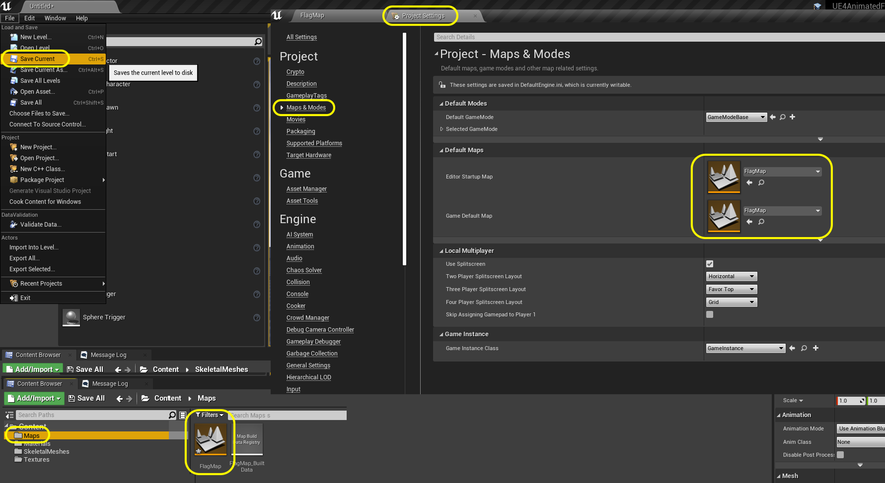

### Bring Model Into Unreal

[previous](../) • [home](../README.md#user-content-ue4-animated-flag) • [next](../)

Lets import the model into Unreal and set it up for being used as a skeletal mesh for the UE4 cloth system.

 

---

##### `Step 1.`\|`ITA`|:small_blue_diamond:

Open up the **Epic Games Launcher** and run the latest version of the game.

##### `Step 2.`\|`FHIU`|:small_blue_diamond: :small_blue_diamond: 

In the **Select or Create New Project** screen select a new **Games** project and press the <kbd>Next</kbd> button.  

The **Select Template** screen comes up and we will select **Blank** and press the <kbd>Next</kbd> button. 

##### `Step 3.`\|`ITA`|:small_blue_diamond: :small_blue_diamond: :small_blue_diamond:

In **Project Settings** select a **Bluerprint** only project for **Desktop/Console** with no **Starter Content**.  Select a **Folder** and **Name** to store the new project.

##### `Step 4.`\|`ITA`|:small_blue_diamond: :small_blue_diamond: :small_blue_diamond: :small_blue_diamond:

Create three new folders to hold assets needed for this walk through `Textures`, `Materials` and `StaticMeshes`.

##### `Step 5.`\|`ITA`| :small_orange_diamond:

Download the [T_USFlag.png](../Assets/T_USFlag.png) texture.  Drag and drop it into the **Textures** folder in the **UE4** project.

##### `Step 6.`\|`ITA`| :small_orange_diamond: :small_blue_diamond:

Now open up the **T_USFlag** texture.  Make sure it is a power of 2 size on both the **x** and **y** axis as well as a **Normal** compression with actual **Mip** levels.  Please note that the flag aspect ratio is distorted as we distored the UV's to be square.  When applied the aspect ratio should correct itself as the UV's will alter the textures aspect ratio to match the plane we created.

##### `Step 7.`\|`ITA`| :small_orange_diamond: :small_blue_diamond: :small_blue_diamond:

Create a new **Material** in the **Materials** folder and name it `M_Flag`.

##### `Step 8.`\|`ITA`| :small_orange_diamond: :small_blue_diamond: :small_blue_diamond: :small_blue_diamond:

Open up **M_Flag** and right click on the empty graph.  Select a **Texture Sample** node.  Highlight the node and change the **Texture** to `T_USFlag`. Select the plane on the model preview panel.

##### `Step 9.`\|`ITA`| :small_orange_diamond: :small_blue_diamond: :small_blue_diamond: :small_blue_diamond: :small_blue_diamond:

Connect the **RGB** output pin from the **Texture Sample** node to the **Base Color** pin on the shader.

##### `Step 10.`\|`ITA`| :large_blue_diamond:

Add a **Constant** node and set it to `.45` and send it to the **Roughness** pin in the shader.  This will make the flag a bit shiny.  Lets leave it here for the material so lets press the <kbd>Apply</kbd> button.

##### `Step 11.`\|`ITA`| :large_blue_diamond: :small_blue_diamond: 

Import **SK_Flag** that you crated in Maya and drag it into the **SkeletalMeshes** folder.  Select **Skeletal Mesh** and don't assign a skeleton.  In **Material Input Method** select `Do Not Create Material`.  Press the <kbd>Import</kbd> button.

##### `Step 12.`\|`ITA`| :large_blue_diamond: :small_blue_diamond: :small_blue_diamond: 

*Double click* to open **SK_Flag** and assign the `M_Flag` to the **Material Slot**.

##### `Step 13.`\|`ITA`| :large_blue_diamond: :small_blue_diamond: :small_blue_diamond:  :small_blue_diamond: 

Now drag the **SK_Flag** into the game.  Notice that the flag lies flat and the pivot is on the wrong side.  Lets fix that.

##### `Step 14.`\|`ITA`| :large_blue_diamond: :small_blue_diamond: :small_blue_diamond: :small_blue_diamond:  :small_blue_diamond: 

Open up **SK_Flag** in **Maya** and move the pivot to the opposite side by pressing **D** to adjust the location.

##### `Step 15.`\|`ITA`| :large_blue_diamond: :small_orange_diamond: 

Move the pivot point to be in the `0, 0` location in the world.  It helps to see all four views to move it precisely to the center.

##### `Step 16.`\|`ITA`| :large_blue_diamond: :small_orange_diamond:   :small_blue_diamond: 

Now select **File | Game Exporter** and the only major change we will make is select **Up Axis | Z**.  By default **Maya** is **Y** up and **UE4** is **Z** up.

##### `Step 17.`\|`ITA`| :large_blue_diamond: :small_orange_diamond: :small_blue_diamond: :small_blue_diamond:

Go back to **Unreal** and delete the three files.  Re-import the new **SK_Flag** as a skeletal mesh with no material then press the <kbd>Import</kbd> button.

##### `Step 18.`\|`ITA`| :large_blue_diamond: :small_orange_diamond: :small_blue_diamond: :small_blue_diamond: :small_blue_diamond:

Open up the new **SK_Flag**.  Assign the **M_Flag** to the skeletal mesh.  Save the work and drag **SK_Mesh** into the level.  Now the orientation is correct and the pivot point is on the right side.

##### `Step 19.`\|`ITA`| :large_blue_diamond: :small_orange_diamond: :small_blue_diamond: :small_blue_diamond: :small_blue_diamond: :small_blue_diamond:

Lets add a **Basic | Cylinder** to the level and call it `Flag Pole`.  Change the **Transform | Scale** to `0.1, 0.1, 3.0`.  Position it in the middle of the level.

##### `Step 20.`\|`ITA`| :large_blue_diamond: :large_blue_diamond:

1.  Adjust the flag to be on the right part of the pole.  Look at it from all angles.

2.  Adjust the **Player Start** to be in front of the flag. Rotate it so the **X** axis faces the flag.

3.  When you hit play you should see the flag.

##### `Step 21.`\|`ITA`| :large_blue_diamond: :large_blue_diamond: :small_blue_diamond:

Add a folder called **Maps**. Press **File | Save Current** and save the room and call it `FlagMap`.

Open up **Project Settings** and select **Maps and Modes**.  Change the default room at load to **FlagMap**.

___

| [previous](../)| [home](../README.md#user-content-ue4-animated-flag) | [next](../)|
|---|---|---|
