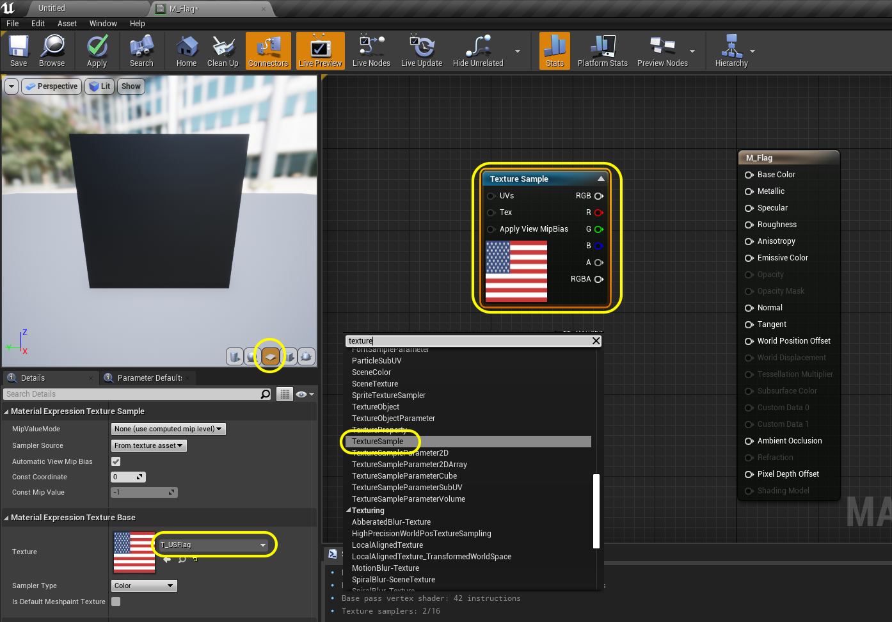

### Bring Model Into Unreal

[previous](../) • [home](../README.md#user-content-ue4-animated-flag) • [next](../)

Lets import the model into Unreal and set it up for being used as a skeletal mesh for the UE4 cloth system.

 

---

##### `Step 1.`\|`ITA`|:small_blue_diamond:

Open up the **Epic Games Launcher** and run the latest version of the game.

##### `Step 2.`\|`FHIU`|:small_blue_diamond: :small_blue_diamond: 

In the **Select or Create New Project** screen select a new **Games** project and press the <kbd>Next</kbd> button.  

The **Select Template** screen comes up and we will select **Blank** and press the <kbd>Next</kbd> button. 

##### `Step 3.`\|`ITA`|:small_blue_diamond: :small_blue_diamond: :small_blue_diamond:

In **Project Settings** select a **Bluerprint** only project for **Desktop/Console** with no **Starter Content**.  Select a **Folder** and **Name** to store the new project.

##### `Step 4.`\|`ITA`|:small_blue_diamond: :small_blue_diamond: :small_blue_diamond: :small_blue_diamond:

##### `Step 5.`\|`ITA`| :small_orange_diamond:

Create three new folders to hold assets needed for this walk through `Textures`, `Materials` and `StaticMeshes`.

##### `Step 6.`\|`ITA`| :small_orange_diamond: :small_blue_diamond:

Download the [T_USFlag.png](../Assets/T_USFlag.png) texture.  Drag and drop it into the **Textures** folder in the **UE4** project.

##### `Step 7.`\|`ITA`| :small_orange_diamond: :small_blue_diamond: :small_blue_diamond:

Now open up the **T_USFlag** texture.  Make sure it is a power of 2 size on both the **x** and **y** axis as well as a **Normal** compression with actual **Mip** levels.  Please note that the flag aspect ratio is distorted as we distored the UV's to be square.  When applied the aspect ratio should correct itself as the UV's will alter the textures aspect ratio to match the plane we created.

##### `Step 8.`\|`ITA`| :small_orange_diamond: :small_blue_diamond: :small_blue_diamond: :small_blue_diamond:

Create a new **Material** in the **Materials** folder and name it `M_Flag`.

##### `Step 9.`\|`ITA`| :small_orange_diamond: :small_blue_diamond: :small_blue_diamond: :small_blue_diamond: :small_blue_diamond:

Open up **M_Flag** and right click on the empty graph.  Select a **Texture Sample** node.  Highlight the node and change the **Texture** to `T_USFlag`. Select the plane on the model preview panel.

##### `Step 10.`\|`ITA`| :large_blue_diamond:

Connect the **RGB** output pin from the **Texture Sample** node to the **Base Color** pin on the shader.

##### `Step 11.`\|`ITA`| :large_blue_diamond: :small_blue_diamond: 

##### `Step 12.`\|`ITA`| :large_blue_diamond: :small_blue_diamond: :small_blue_diamond: 

##### `Step 13.`\|`ITA`| :large_blue_diamond: :small_blue_diamond: :small_blue_diamond:  :small_blue_diamond: 

##### `Step 14.`\|`ITA`| :large_blue_diamond: :small_blue_diamond: :small_blue_diamond: :small_blue_diamond:  :small_blue_diamond: 

##### `Step 15.`\|`ITA`| :large_blue_diamond: :small_orange_diamond: 

##### `Step 16.`\|`ITA`| :large_blue_diamond: :small_orange_diamond:   :small_blue_diamond: 

##### `Step 17.`\|`ITA`| :large_blue_diamond: :small_orange_diamond: :small_blue_diamond: :small_blue_diamond:

##### `Step 18.`\|`ITA`| :large_blue_diamond: :small_orange_diamond: :small_blue_diamond: :small_blue_diamond: :small_blue_diamond:

##### `Step 19.`\|`ITA`| :large_blue_diamond: :small_orange_diamond: :small_blue_diamond: :small_blue_diamond: :small_blue_diamond: :small_blue_diamond:

##### `Step 20.`\|`ITA`| :large_blue_diamond: :large_blue_diamond:

##### `Step 21.`\|`ITA`| :large_blue_diamond: :large_blue_diamond: :small_blue_diamond:

___

| [previous](../)| [home](../README.md#user-content-ue4-animated-flag) | [next](../)|
|---|---|---|
