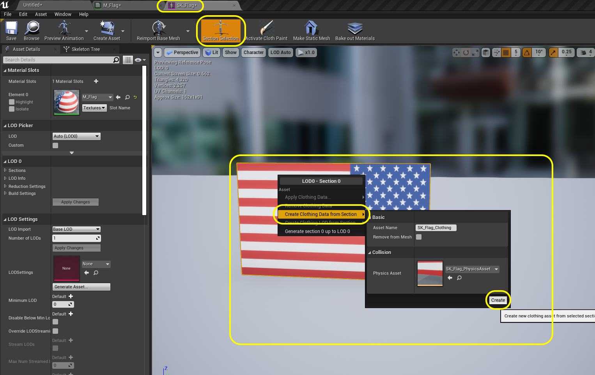
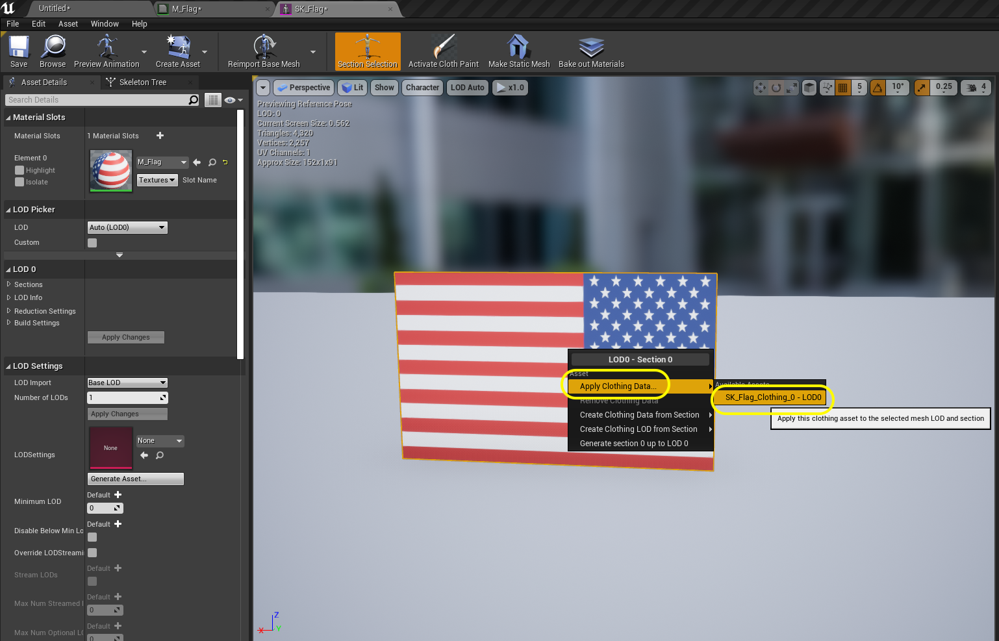
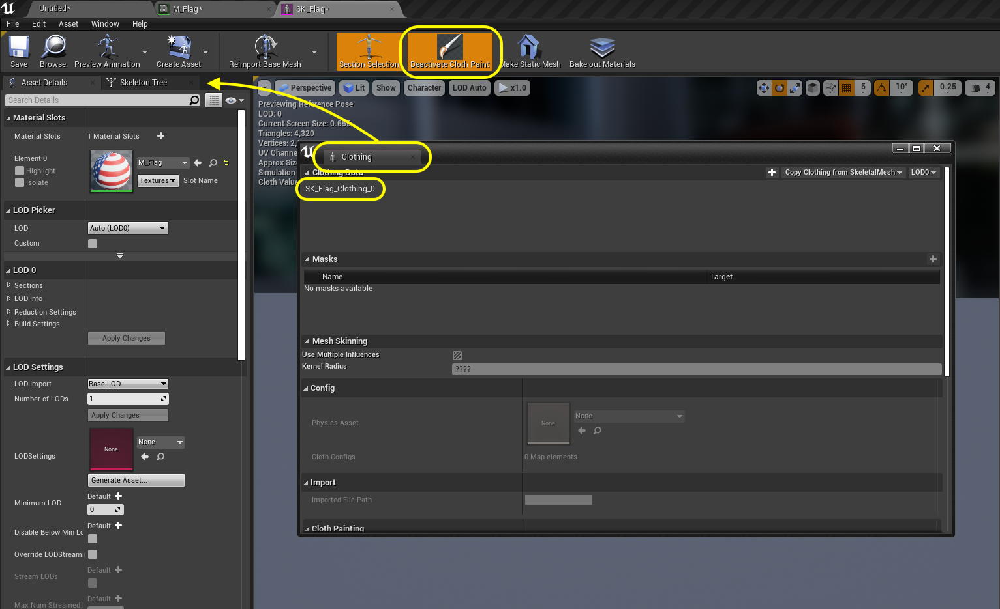
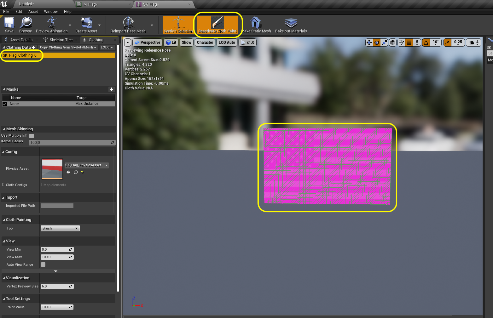
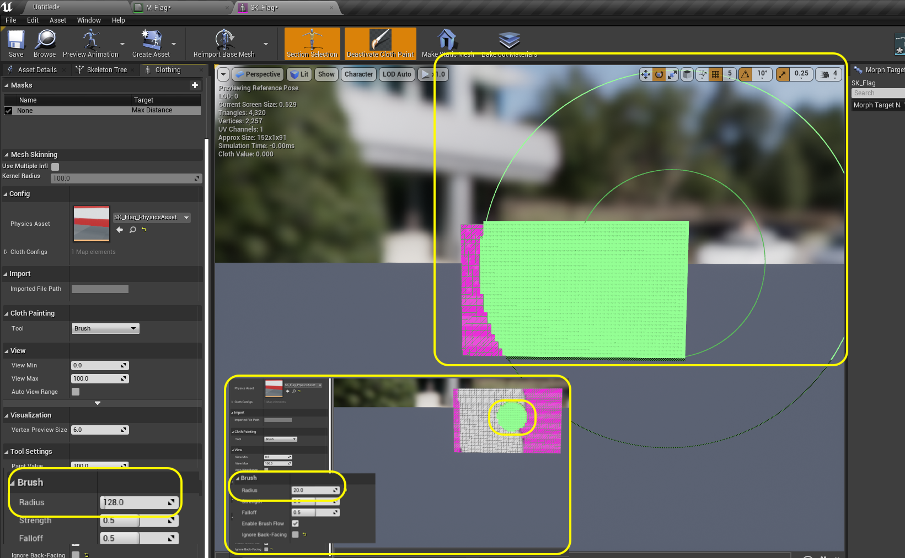
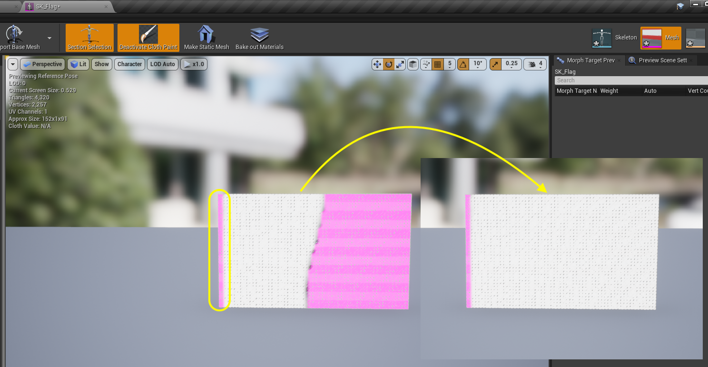
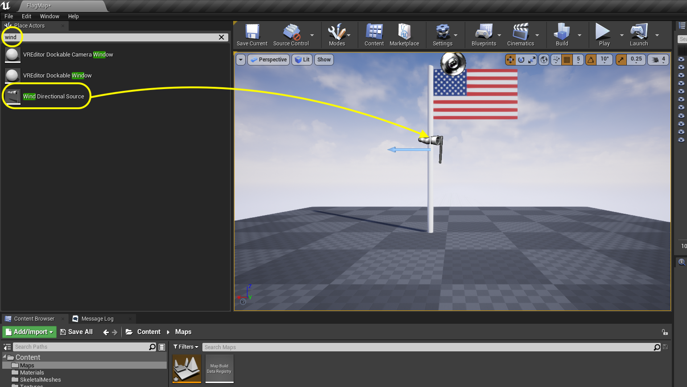
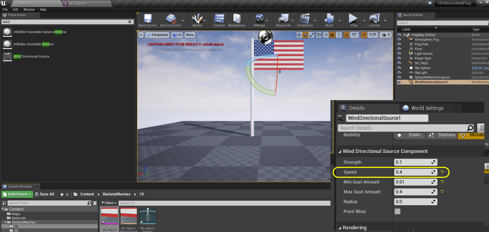

### Static Mesh to Cloth

[previous](../) • [home](../README.md#user-content-ue4-animated-flag) • 

Lets turn this static-mesh to an animated cloth.

 

---

##### `Step 1.`\|`ITA`|:small_blue_diamond:

Open up **SK_Flag** and press the **Section Selection** tab on the top bar. Select the static mesh in the preview window. Right click on the selected flag and choose the **Create Clothing Data from Section**, leave the defaults and press the <kbd>Create</kbd> button.

##### `Step 2.`\|`FHIU`|:small_blue_diamond: :small_blue_diamond: 

Right click on the flag again and now select **Apply Clothing Data | SM_Flag_Clothing_0**.

##### `Step 3.`\|`ITA`|:small_blue_diamond: :small_blue_diamond: :small_blue_diamond:

Select **Activate Cloth Paint** tab on the top bar.  This pops up the **Clothing** window.  Dock this on the menu on the left next to the **Skeleton Tree** tab.  Select the **Clothing Data | SK_Flag_Clothing_0** item in the **Clothing** tab.

##### `Step 4.`\|`ITA`|:small_blue_diamond: :small_blue_diamond: :small_blue_diamond: :small_blue_diamond:

Now the flag should turn pink.  It is ready to edit.  Pink means that it is not cloth.  So if we left it as is, it would be a non-animating object.  

##### `Step 5.`\|`ITA`| :small_orange_diamond:

We need to paint where the item is cloth.  We will leave the left side pink as it is supposed to be rigidly attached to the pole.  Our default **Brush | Radius** of `120` is way to big.  Lower it to make the brush size more reasonable. 

##### `Step 6.`\|`ITA`| :small_orange_diamond: :small_blue_diamond:

Paint the entire right side leaving a small strip of pink on the left which will not act as cloth and be rigid next to the pole.

##### `Step 7.`\|`ITA`| :small_orange_diamond: :small_blue_diamond: :small_blue_diamond:

Now we can finally see the fruits of our labor.  Selec the **Deactivate Cloth Paint** and now the areas that are white fall downward and drape like cloth!

##### `Step 8.`\|`ITA`| :small_orange_diamond: :small_blue_diamond: :small_blue_diamond: :small_blue_diamond:

Go back to the game and *press* the <kbd>Play</kbd> button in the top menu bar to launch the game. Now you can see the flag droop in the game.

##### `Step 9.`\|`ITA`| :small_orange_diamond: :small_blue_diamond: :small_blue_diamond: :small_blue_diamond: :small_blue_diamond:

*Add* a **Place Actors | Wind Directional Source** actor into the game.  This will act as a wind source for the entire level.

##### `Step 10.`\|`ITA`| :large_blue_diamond:

Now play with the direciton of the wind by rotating the **Wind Direction Source** actor.  There is a grey arrow indicating the direction of the wind.  Now for the wind settings lets leave **Point Wind** as false.  This is a setting for a single location of the wind (like a fan), then the **Radius** has an effect of how far that wind goes before it dies out.

With it set to **false** this wind affects the entire level without going down.  The **Min Gust Amount** and **Max Gust Amount** are how much variation there is in the wind **Speed**.  The wind **Speed** is how hard it is blowing.  The wind **Strength** is how much of the entire windscape weight (if you have multiple wind direction sources) does this have.  So we can just focue on the **Speed** as this is the only one that will affect our flag.

##### `Step 11.`\|`ITA`| :large_blue_diamond: :small_blue_diamond: 

Now *press* the <kbd>Play</kbd> button in the top menu bar to launch the game. The flag should be waving in the wind.  Play with the speed and angle until you get the effect you are looking for.

https://user-images.githubusercontent.com/5504953/139281586-b51170e5-446d-4160-8f15-73c4df16f92e.mp4

##### `Step 12.`\|`ITA`| :large_blue_diamond: :small_blue_diamond: :small_blue_diamond: 

I went back into Maya and created two more flags.  One with 1/4 the polygons being 30 by 18 polyogons (as opposed to the original 60 by 36), and another at the polygons at 10 by 6.  You can see that the detail in the flapping flag is affected as the object can only animate with the vertices.

https://user-images.githubusercontent.com/5504953/139283219-dc472f27-850c-4bb1-9a06-13510c18bf25.mp4

##### `Step 13.`\|`ITA`| :large_blue_diamond: :small_blue_diamond: :small_blue_diamond:  :small_blue_diamond: 

I downloaded **[Speed Tree for UE4](https://store.speedtree.com/buy-try/)** and added a few free trees.  I wanted to see how the combination of wind on the flag and trees would look like.  The wind only affects foliage and cloth in the engine. I ended up having to create three point volumes for each flag on the pole as the amount of wind to keep the flag up made the trees look like they were in a hurricane.  So I have a lot less overall level wind and smaller point wind on the flags.

https://user-images.githubusercontent.com/5504953/139294023-1ad6f4ef-be6b-4ba8-be7d-dac3c3da5e3d.mp4

___

| [previous](../)| [home](../README.md#user-content-ue4-animated-flag) | 
|---|---|
